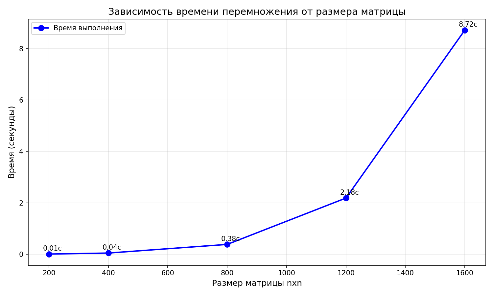

# Лабораторная работа 1
Мной была разработана программа на C++ для перемножения двух квадратных матриц. Реализована генерация случайных матриц, замер времени выполнения, сохранение результатов в файлы. Написан скрипт на Python для верификации через numpy и построения графика.
# Файлы
`matrix.cpp` - основная программа на C++

`verify_plot.py` - верификация и график

`matrices/` - сгенерированные матрицы

`results.csv` - результаты замеров

`plot.png` - график производительности
# Запуск программы

g++ -std=c++11 -O2 -o matrix.exe matrix.cpp

./matrix.exe

python verify_plot.py

# Результаты экспериментов
Таблица измерений
| Размер матрицы | Время выполнения (с) | Арифметических операций |
|----------------|---------------------|------------------------|
| 200 × 200      | 0.0052    | 16 000 000            |
| 400 × 400      | 0.0449    | 128 000 000           |
| 800 × 800      | 0.3815    | 1 024 000 000         |
| 1200 × 1200    | 2.1850    | 3 456 000 000         |
| 1600 × 1600    | 8.7164    | 8 192 000 000         |

График зависимости времени от размера

# Вывод
Программа корректно перемножает квадратные матрицы. Все результаты проверены и подтверждены.
