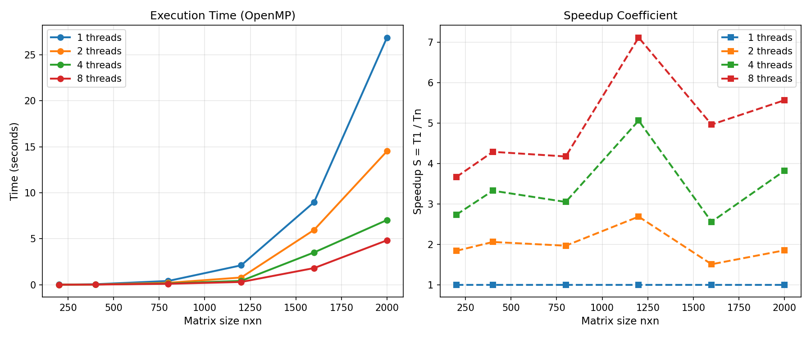

# Лабораторная работа 2
Мной была модифицирована программа из лабораторной работы №1 для параллельной работы по технологии OpenMP. Реализовано параллельное перемножение квадратных матриц. Проведена серия экспериментов с разным количеством потоков (1, 2, 4, 8) и разными размерами матриц (200, 400, 800, 1200, 1600, 2000). Выполнена автоматизированная верификация результатов через numpy и построение графиков производительности и ускорения.
# Файлы
`matrix_openmp.cpp` - основная программа на C++ с OpenMP

`verify_plot_openmp.py` - верификация и построение графиков

`matrices/` - сгенерированные матрицы

`results_openmp.csv` - результаты замеров

`plot_openmp.png` - график времени выполнения и ускорения
# Запуск программы

g++ -fopenmp -O2 -std=c++11 matrix_openmp.cpp -o matrix_openmp.exe

./matrix_openmp.exe

python verify_plot_openmp.py

# Результаты экспериментов
Время выполнения (секунды)
| Размер матрицы | 1 поток | 2 потока | 4 потока | 8 потоков |
|----------------|---------|----------|----------|-----------|
| 200 × 200      | 0.0051  | 0.0042   | 0.0021   | 0.0021    |
| 400 × 400      | 0.0457  | 0.0252   | 0.0135   | 0.0135    |
| 800 × 800      | 0.3882  | 0.1993   | 0.1144   | 0.0825    |
| 1200 × 1200    | 2.0802  | 0.8246   | 0.4258   | 0.3748    |
| 1600 × 1600    | 10.7984 | 5.0569   | 2.4310   | 1.5102    |
| 2000 × 2000    | 24.5651 | 12.3167  | 6.1863   | 4.0063    |

# Графики
Время выполнения и ускорение

# Вывод
В ходе выполнения лабораторной работы была успешно реализована параллельная программа перемножения матриц с использованием OpenMP. Чем больше размер матрицы, тем эффективнее параллелизация. Для маленьких матриц (200×200) ускорение ограничено накладными расходами на создание потоков. Для матриц среднего размера (1200×1200) достигнуто максимальное ускорение 7.12. Для больших матриц (2000×2000) ускорение составляет 5.57 из-за ограничений кэш-памяти.
